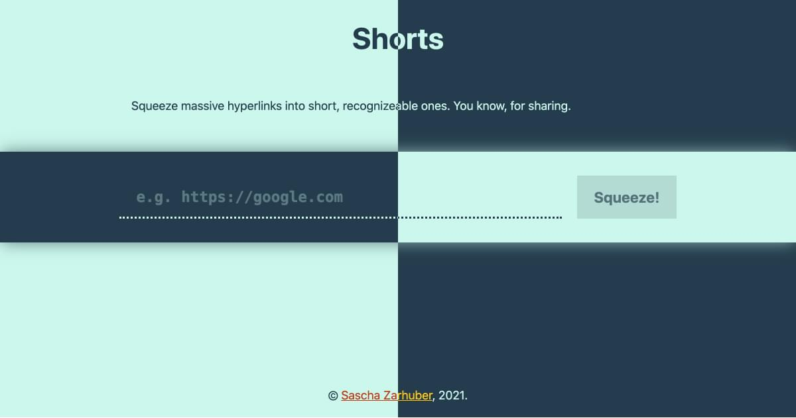

<div align="center">
  
  <br />
  <h1><a href="https://a.sascha.link/" rel="noopener noreferrer">Shorts</a></h1>
  <strong>🔗✂️ A service for shortening URLs.</strong>
  <br />
  <br />
  <a href="https://github.com/vorchdorf-dot-media/shorts/actions/workflows/deploy-to-cloudflare.yml"></a>  
  <br />
  <br />
  
  <br />
  <br />
  <br />
</div>

## About

This repository contains the source code for [Shorts](https://a.sascha.link) — a service for squeezing massive hyperlinks into short, memorable ones.

## Build Setup

```bash
# install dependencies
$ npm install # or: yarn install

# serve with hot reload at localhost:3000
$ npm run dev # or: yarn dev

# build for production and launch server
$ npm run build # or: yarn build
$ npm run preview # or: yarn preview
```

## License

Licensed under the MIT license.

Copyright ©️ 2021 [Sascha Zarhuber](https://sascha.work)
